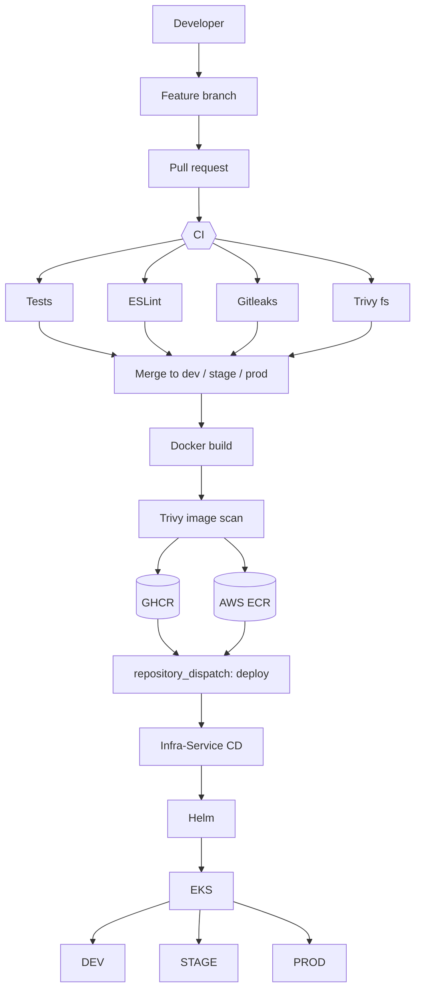

# Expert Listing – Geo-Bucket Service

Express API that maps coordinates to deterministic grid "buckets" so experts and clients in the same area can be grouped for nearby lookups.

> **Deployment infrastructure and CD are managed by [Experts-Listing/Infra-Service](https://github.com/Experts-Listing/Infra-Service).**
> This repository only builds, tests, scans and publishes an immutable container image. It contains no Terraform, Helm or Kubernetes configuration.

## API

| Method | Path | Description |
|---|---|---|
| GET | `/healthz` | Liveness probe |
| GET | `/readyz` | Readiness probe |
| GET | `/api/geo/bucket?lat=&lng=&precision=` | Bucket id and bounds for a point. `precision` 0–3 (1° down to 0.001°, default 1) |

Example: `GET /api/geo/bucket?lat=6.5244&lng=3.3792` returns `{"id":"1:65:33","bounds":{"south":6.5,"west":3.3,"north":6.6,"east":3.4},...}`

## Local development

Requires Node 22 (`.nvmrc`).

```bash
npm ci
npm run dev      # http://localhost:3000
npm test         # node:test + supertest
npm run lint     # ESLint
```

Configuration (see `.env.example`): `PORT` (default `3000`), `LOG_LEVEL` (default `info`). Logs are JSON on stdout.

## Docker

```bash
docker build -t geo-bucket:local .
docker run --rm -p 3000:3000 geo-bucket:local
curl "localhost:3000/api/geo/bucket?lat=6.52&lng=3.37"
```

Multi-stage `node:22-alpine` image with production dependencies only, npm removed from the runtime layer, and running as the non-root `node` user.

## Branch strategy

```
feature/* ──PR──▶ dev ──PR──▶ stage ──PR──▶ prod
```

- Every PR into `dev`, `stage` or `prod` runs validation CI. Nothing is published from a PR.
- A push (merge) to `dev`, `stage` or `prod` publishes an image and requests a deploy to the environment with the same name.

## CI/CD flow



`.github/workflows/ci.yml` jobs:

| Job | Runs on | What it does |
|---|---|---|
| `test` | PR + push | `npm ci`, `npm test` |
| `lint` | PR + push | `npm ci`, `npm run lint` |
| `secret-scan` | PR + push | Gitleaks over the full git history, fails on any finding |
| `trivy-fs` | PR + push | Trivy vuln/secret/misconfig scan of the repo. HIGH+CRITICAL reported, fixable CRITICAL fails |
| `image` | PR + push | Builds the image and scans it with Trivy (fixable CRITICAL fails). **On push only:** pushes to GHCR and ECR |
| `trigger-deploy` | push | Sends a `deploy` event to Infra-Service |
| `notify` | PR + push | Slack message on any failed job, and on a successful publish + deploy trigger |

### Security gates

- **Gitleaks** blocks committed API keys, tokens, passwords, private keys and cloud credentials.
- **Trivy** fails the build on CRITICAL vulnerabilities that have a fix available, in both dependencies and the final image. HIGH findings and unfixable CRITICALs are printed in the job log so they stay visible, but they do not block.
- No credentials exist in the repo: GHCR uses the workflow `GITHUB_TOKEN`, AWS uses GitHub OIDC, and the deploy trigger uses the `INFRA_DISPATCH_TOKEN` secret.

### Images

The only deployment tag is the full Git commit SHA, and the same locally built image is pushed to both registries:

```
ghcr.io/experts-listing/geo-bucket:<git-sha>
<account-id>.dkr.ecr.<region>.amazonaws.com/expert-listing/geo-bucket:<git-sha>
```

ECR tags are immutable. If a SHA already exists (for example, a fast-forward promotion from `dev` to `stage`), the ECR push is skipped and the existing image is deployed.

### Deployment trigger

After publishing, CI calls `POST /repos/Experts-Listing/Infra-Service/dispatches` using the `INFRA_DISPATCH_TOKEN` secret:

```json
{
  "event_type": "deploy",
  "client_payload": {
    "service": "geo-bucket",
    "environment": "dev",
    "registry": "<account-id>.dkr.ecr.<region>.amazonaws.com",
    "repository": "expert-listing/geo-bucket",
    "tag": "<git-sha>",
    "commit": "<git-sha>",
    "source_repository": "Experts-Listing/Expert-Listing-Geo-Bucket",
    "source_run_url": "https://github.com/..."
  }
}
```

Infra-Service validates the event, deploys the exact image with Helm, waits for the rollout and reports the result. Production approval is enforced by the `prod` environment in Infra-Service.

## Required GitHub configuration

| Kind | Name | Purpose |
|---|---|---|
| Variable | `AWS_REGION` | Region of the ECR registry |
| Variable | `AWS_ECR_PUSH_ROLE_ARN` | IAM role assumed via OIDC. It can only push to `expert-listing/geo-bucket` (output of Infra-Service Terraform) |
| Secret | `INFRA_DISPATCH_TOKEN` | Fine-grained token limited to `Infra-Service` with **Contents: Read and write** (required by `repository_dispatch`) |
| Secret | `SLACK_WEBHOOK_URL` | Slack incoming webhook (org-level). Notifications are skipped if it is not set |

GHCR needs no extra secret, because it uses `GITHUB_TOKEN` with `packages: write`.

Recommended repository settings (not created by this repo):

- Default branch `dev`.
- Rulesets for `dev`, `stage`, `prod`: require a pull request, require the `test`, `lint`, `secret-scan`, `trivy-fs` and `image` checks, and block force-pushes and deletion.
- At least one approving review for PRs into `stage` and `prod`.
